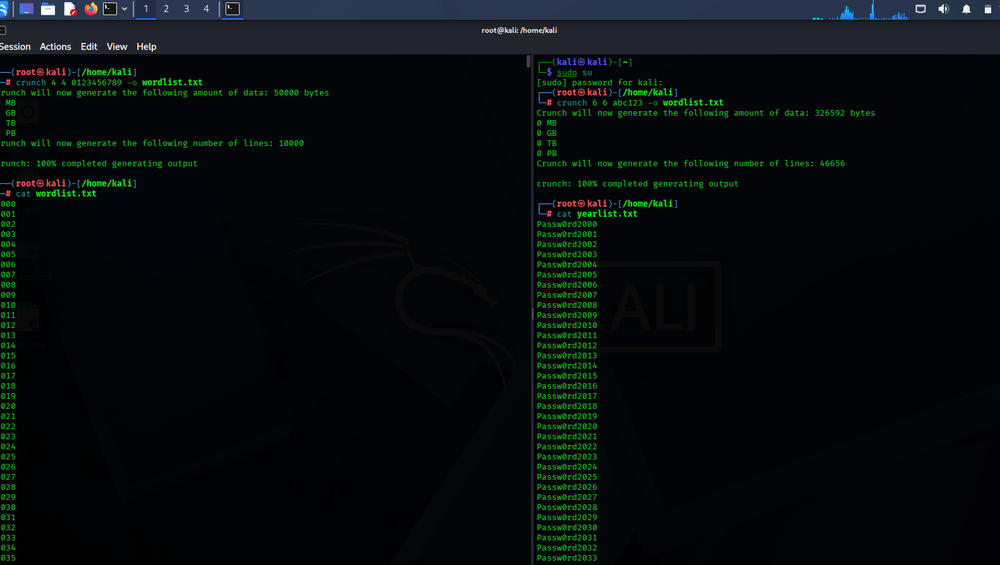
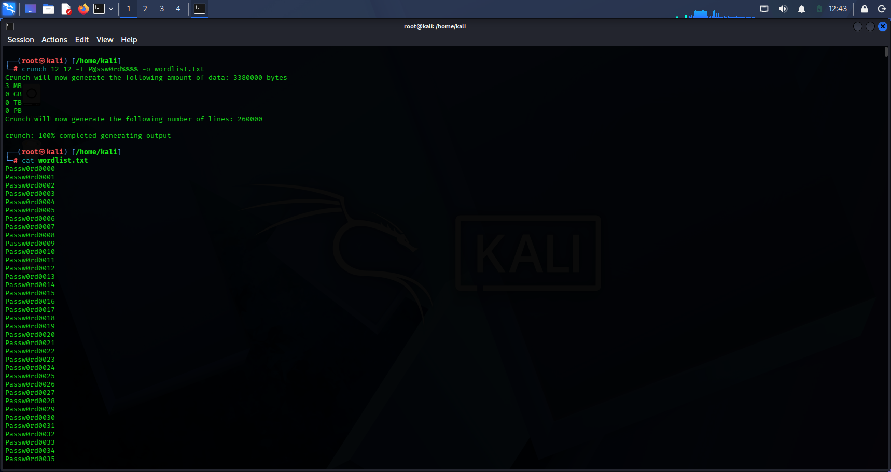
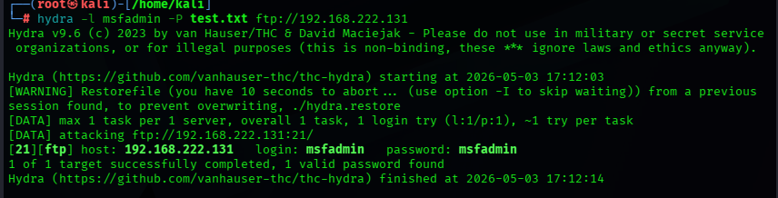
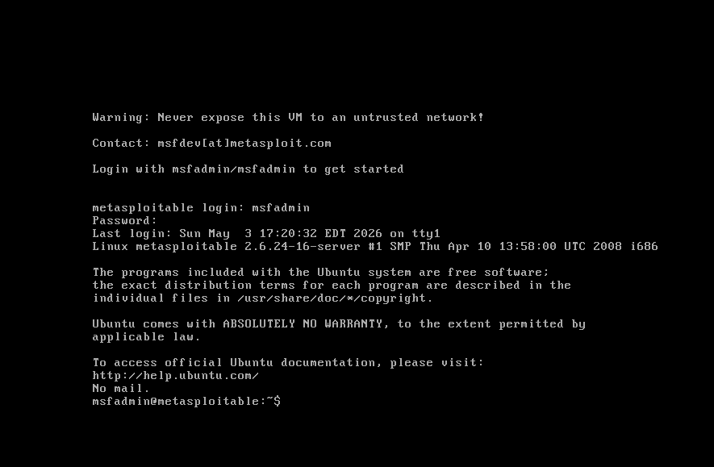

# Brute Force Attack Simulation (Hydra + Crunch)

## Objective
To simulate a brute-force attack using Hydra with a custom-generated wordlist.

## Tools Used
- Hydra
- Crunch
- Kali Linux
- Metasploitable

## Target
- Service: FTP
- IP Address: 192.168.222.131

## Methodology

### Wordlist Generation

- crunch 4 4 0123456789 -o wordlist.txt
- crunch 6 6 abc123 -o wordlist.txt

### Attack Execution
hydra -l msfadmin -P test.txt ftp://192.168.222.131

## Command Breakdown
-  `-l` : specifies the username
-  `-P` : specifies the password wordlist
-   `ftp://` : defines the target service  

## Results
- Hydra executed multiple login attempts using the provided wordlist
- Initial attempts resulted in failed logins
- A valid credential pair was successfully discovered:

  Username: msfadmin  
  Password: msfadmin  

- This confirms that the target system is vulnerable to brute-force attacks due to weak authentication credentials

## Screenshots

### Wordlist

### Hydra Attack

### Successful Login

## Attack Summary
A brute-force attack was performed against an FTP service using Hydra with both a custom-generated wordlist and a common password dataset. Multiple failed login attempts were observed before successfully identifying valid credentials.

## Mitigation
- Use strong passwords  
- Enable account lockout  
- Implement multi-factor authentication  

## Conclusion
This lab demonstrates how weak credentials can be compromised using brute-force attacks.

## Disclaimer

All activities, scans, exploitations, and simulations demonstrated in this repository were conducted in a controlled lab environment for educational and ethical purposes only. The target systems used were intentionally vulnerable systems owned or authorized for testing. Unauthorized testing against real-world systems is illegal and unethical.

